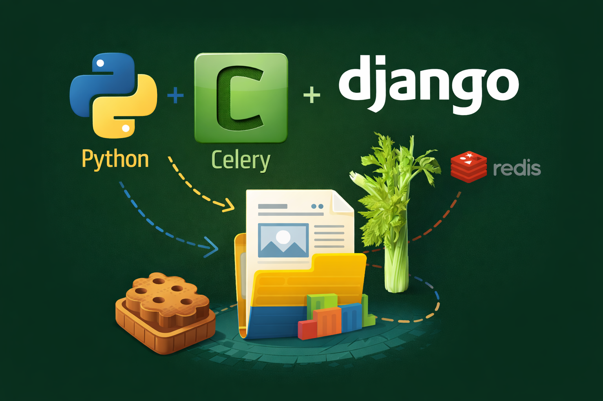

# Cookiecutter Django + Celery

Template for a minimal, production-minded Django + Celery + Redis backend, with Docker and QA tooling.

Created by Juan manuel Cristóbal Moreno.

## What's included

- Django configured with ASGI/WSGI and a health endpoint at `/api/health/`.
- Celery with worker and beat, plus example tasks `ping` and `add`.
- Redis as broker and result backend.
- Separate Dockerfiles (web/worker/beat) and `docker-compose` for dev.
- CLI scripts: `<project_slug>-manage`, `<project_slug>-celery`, `<project_slug>-migrate`.
- Smoke tests and quality tooling (black, flake8, ruff, mypy, pytest, tox).

## Requirements

- Python 3.12+ (or the version you choose in the template).
- Cookiecutter.

## Usage (generate project)

```bash
pip install cookiecutter
cookiecutter https://github.com/juanmcristobal/cookiecutter-django-celery
```

## Template variables

- project_name: Human-friendly project name (e.g., "My Project").
- project_slug: Lowercase slug for folders/URLs and CLI names; defaults from `project_name`.
- package_name: Python package namespace derived from `project_slug` (hyphens become underscores).
- distribution_name: Distribution name derived from `project_slug` (underscores become hyphens).
- version: Initial project version.
- description: Short project description.
- author_name: Author name.
- author_email: Author email.
- python_version: Python version for Docker and `pyproject.toml`.
- django_version: Minimum Django version.

## After generating the project (local)

```bash
cd <project_slug>
python -m venv .venv
source .venv/bin/activate
pip install -e ".[dev,server,tasks]"
```

Web (WSGI):
```bash
<project_slug>-manage runserver
```

Web (ASGI):
```bash
uvicorn <package_name>.server.asgi:application --host 0.0.0.0 --port 8000
```

Worker and beat:
```bash
<project_slug>-celery worker -l info
<project_slug>-celery beat -l info
```

Health check:
```bash
curl http://localhost:8000/api/health/
```

## Docker (dev)

```bash
cd <project_slug>
docker compose up --build
```

## Useful commands (Makefile)

- `make venv`: create the virtualenv.
- `make install`: install the project in editable mode with extras.
- `make format` / `make format-check`: format or validate formatting.
- `make lint`: run black --check and flake8.
- `make test` / `make coverage`: run pytest (and coverage).
- `make compose-up` / `make compose-down`: start or stop services.

## Tests and QA

```bash
make format-check
make lint
make test
```

Optionally:
```bash
pytest
ruff check src tests
mypy src
```

## Key environment variables

- `DJANGO_DEBUG`: enable/disable debug mode.
- `DJANGO_SECRET_KEY`: secret key (required in production).
- `DJANGO_ALLOWED_HOSTS`: allowed hosts (comma-separated).
- `DATABASE_URL`: database URL (defaults to local SQLite).
- `DJANGO_LOG_LEVEL`: log level (default INFO).
- `CELERY_BROKER_URL` / `CELERY_RESULT_BACKEND`: Redis or another backend.
- `CELERY_TASK_ALWAYS_EAGER`: run tasks synchronously in tests/dev.
- `CELERY_TASK_DEFAULT_QUEUE`: default queue name.
- `CELERY_BEAT_SCHEDULE_FILENAME`: Beat schedule file.
- `CELERY_PING_INTERVAL_SECONDS`: interval for `ping` task.
- `CELERY_ADD_INTERVAL_SECONDS`: interval for `add` task.

## Generated structure (summary)

- `docker-compose.yml`: web/worker/beat services + Redis.
- `Dockerfile.web`, `Dockerfile.worker`, `Dockerfile.beat`, `Dockerfile.dev`.
- `src/<package_name>/server/`: settings, urls, asgi/wsgi.
- `src/<package_name>/core/`: `/api/health/` endpoint and demo tasks.
- `tests/`: smoke tests for Django, Celery, and CLI.

## Support

⭐ Like the repo if you found it useful.

☕ Support me: Say thanks by buying me a coffee!
https://buymeacoffee.com/juanmcristobal

💼 Open to work:
https://www.linkedin.com/in/jmcristobal/
